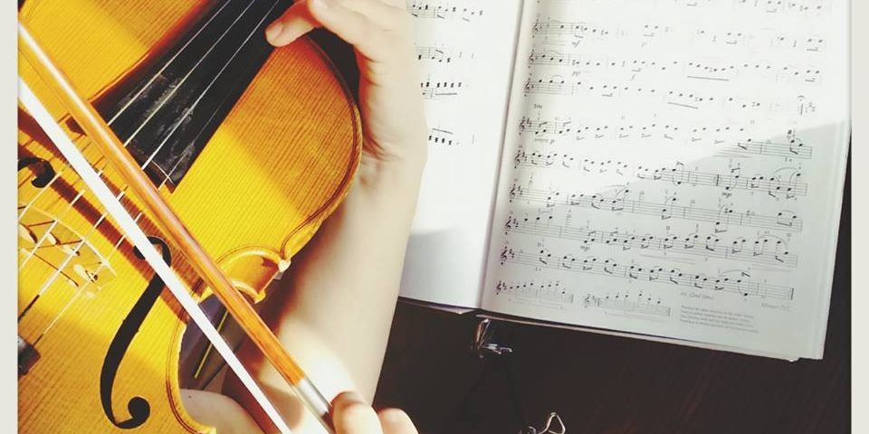

## Contenido {data-background-color="#0B3703"}


- Introducción al curso
	- Estructura
- Formatos desarrollados
	- Características
- Objetivos
- Personas a las que va dedicado
- Conclusiones
- Bibliografía


# **INTRODUCCIÓN AL CURSO** {data-background-image="Imagenes/viena2.jpg"}


## Introducción {data-background-color="#0B3703"}

* El curso virtual está dedicado a hacer un recorrido de toda la música del Clasicismo (1750-1800, aproximadamente), tanto instrumental como vocal y escénica.
* El curso recorre:
	- Los aspectos más relevantes de este período
	- Los autores más prolíficos
	- La creación de la orquesta clásica e instrumentos
	- Análisis de las principales formas y obras
	- Obras principales 
* El curso está dividido en 7 temas principales:


# Estructura {data-background-image="Imagenes/viena2.jpg"}

## Temas: {data-background-color="#0B3703"}

* Tema 1: Introducción
	- Contexto Histórico y Social
	- La Proliferación de Obras Didácticas
	- Música en el Ámbito Privado
* Tema 2: Conceptos estilísticos
	- Estilo Galante
	- Rococó
	- _Empfindsamer Stil_
	- Preclasicismo


## Temas: {data-background-color="#0B3703"}

* Tema 3: Domenico Scarlatti
	- Producción artística
* Tema 4: Carl Philip Emanuel Bach 
	- Carácter
	- Obra
	- Recepción

---

## Temas: {data-background-color="#0B3703"}

* Tema 5: Los Inicios del Repertorio Sinfónico: las cortes de Milán y Mannheim
	- Origen de la Sinfonía
	- G.B. Sammartini
	- J. Stamitz
	- Comienzos del Sinfonismo Vienés
* Tema 6: Johann Christian Bach
	- Estilo y Reputación
	- Obra
* Tema 7: Joseph Haydn
	- Obra


## Temas: {data-background-color="#0B3703"}

* Tema 8: Wolfgang Amadeus Mozart
	- El estilo sublime de Salzburgo
	- Apuntes 
* Tema 9: Música Escénica del Clasicismo
	- Presentaciones
* Actividades, rúbrica para evaluar vídeos y bibliografía

# FORMATOS DESARROLLADOS {data-background-image="Imagenes/viena2.jpg"}

## Características {data-background-color="#0B3703"}

* 1. El curso ha sido creado con la herramienta Exelearning
* 2. Se han añadido dos presentaciones sobre dos óperas de Mozart
	- Formato Beamer en PDF generadas con pandoc/LaTeX
* 3. Se ha añadido una presentación sobre la historia de la ópera en este siglo
	- Formato HTML usando reveal.js
* 4. Una presentación de introducción general al curso
	- Formato pandoc/reveal.js


## Características {data-background-color="#0B3703"}

* 5. Un guión de prácticas y actividades
	- Formato PDF generado con pandoc/LaTeX
* 6. Apuntes sobre W.A. Mozart
	- Formato EPUB
* 7. Presentación de instrumentos clásicos musicales
	- Generada en Padlet

\centering

{ width=30% }\ 


# OBJETIVOS {data-background-image="Imagenes/viena2.jpg"}

---

## Objetivos principales: {data-background-color="#0B3703"}

- Conocer los distintos períodos musicales del Clasicismo

- Conocer los compositores más representativos 

- Conocer las obras más características del período


## Objetivos principales: {data-background-color="#0B3703"}

- Conocer los principales aspectos formales musicales

- Analizar una partitura de sonatas y sinfonías clásicas (Forma Sonata)

- Adquisición de conocimientos críticos y analíticos en cuanto a una obra musical se corresponde.


# PERSONAS A LAS QUE VA DESTINADO {data-background-image="Imagenes/viena2.jpg"}


## Destinatarios {data-background-color="#0B3703"}

* Este curso está dedicado a personas generalmente jóvenes, aunque es para todos los públicos, con conocimientos básicos de solfeo y lenguaje musical. 
* Alumnos de conservatorios, escuelas de música o conocimientos musicales adquiridos de forma privada. 


## Destinatarios {data-background-color="#0B3703"}

* No es necesario conocer la historia de la música, pues en este curso se aprenderán varios conocimientos de la época clasicista. Se pueden hacer en cualquier sistema operativo.

\centering

{ width=40% }\ 


# CONCLUSIONES {data-background-image="Imagenes/viena2.jpg"}

---

## Conclusiones: {data-background-color="#0B3703"}
```javascript 

* El presente ha sido complejo y largo de desarrollar.
* Exelearning: un poco escueto para meter materiales. 
* Aspectos meritorios:
	- Formato EPUB
	- Uso de Padlet
	- Presentación de ópera en HTML
	- Actividades con vídeos de análisis musical

```

# BIBLIOGRAFÍA {data-background-image="Imagenes/viena2.jpg"}

---

## Bibliografía: {data-background-color="#0B3703"}

* Leslie ORREY: _La ópera: una breve historia_. Barcelona: Destino, 1994.
* _The New Grove Dictionary of Opera_. Stanley Sadie (ed.). London: Macmillan, 1992, 4 vols.
* de la Motte, Diether (1998). _Tratado de armonía_. Barcelona: Idea Books.
* Downs, Phillip G. (1998). _La música clásica. La era de Haydn, Mozart y Beethoven_. Akal Música.

## Bibliografía: {data-background-color="#0B3703"}

* Alsina, Pep; Frederic Sesé (1994). _La música y su evolución_ (1ra edición). Editorial Graó.
* Honolka, Kurt; Reinhand, Kurt; Stäblein, Bruno; Enge, Hans; Netil, Paul (2005). Edaf, ed. _Historia de la música_. Madrid. 

# ¡Espero que disfrutéis! {data-background-image="Imagenes/viena2.jpg"}
